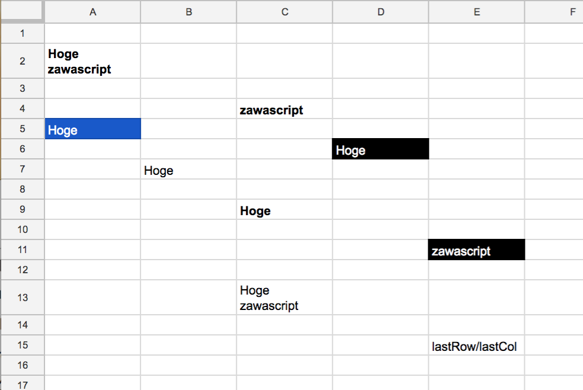

# RangeFinder.gs

## About
It searches the target value from the sheet.   
Various conditions can be set with options.

---

## Spreadsheet Format



## Usage


```javascript
var sheet = SpreadsheetApp.getActiveSheet(); // sheet
var sa = new RangeFinder(sheet);
var options = {
  word:"zawascript",
  type: "CONTAIN",
  multiple: true
}
var target = sa.find(options);
// => [Range(2A) ,Range(4C) ,Range(11E) ,Range(13C)]

options = {
  word:"zawascript",
  type: "MATCH",
  multiple: true
}
target = sa.find(options);
// => [Range(4C) ,Range(11E)]

options = {
  word:"zawascript",
  type: "CONTAIN",
  multiple: true
}
target = sa.find(options);
// => [Range(2A) ,Range(4C) ,Range(11E),Range(13C)]

options = {
  bgColor:"#000000",
  multiple: true
}
target = sa.find(options);
// => [Range(6D) ,Range(11E)]

options = {
  textColor:"#FFFFFF",
  multiple: true
}
target = sa.find(options);
// => [Range(5A) ,Range(6D) ,Range(11E)]

options = {
  word:"zawascript",
  type: "MATCH",
  multiple: false
}
target = sa.find(options);
// => Range(4C)


```

- `rowCount`: Add rowCount to the found cell and return it.
- `colCount`: Add colCount to the found cell and return it.
