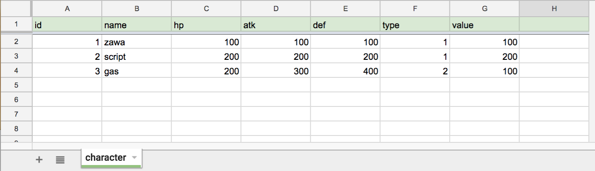

# SheetAccesser.gs

## About

Provide easy access to Spreadsheet.

---

## Spreadsheet Format



- First line -> key
- From the second line -> values

## Usage

### Array(Array)

```javascript
var sa = new SheetAccesser(SPREAD_SHEET_ID);
var values = sa.getAllValues('character');
Logger.log(JSON.stringify(values));
/**
[
  [1 ,'zawa' ,100 ,100 ,100 ,1 ,100],
  [2 ,'script' ,200 ,200 ,200 ,1 ,200],
  [3 ,'gas' ,200 ,300 ,400 2 ,100]
]
**/

values = sa.getValuesForKey('character' ,{type:1});
Logger.log(JSON.stringify(values));
/**
[
  [1 ,'zawa' ,100 ,100 ,100 ,1 ,100],
  [2 ,'script' ,200 ,200 ,200 ,1 ,200]
]
**/

values = sa.getValuesForKey('character' ,{type:1 ,value:100});
Logger.log(JSON.stringify(values));
/**
[
  [1 ,'zawa' ,100 ,100 ,100 ,1 ,100]
]
**/

// dump
values.push([2 ,'hoge' ,999 ,999 ,999 ,9 ,100000]);
sa.dumpValues('character',values);
var dumped = sa.getAllValues('character');
Logger.log(JSON.stringify(dumped));
/**
[
  [1 ,'zawa' ,100 ,100 ,100 ,1 ,100],
  [2 ,'hoge' ,999 ,999 ,999 ,9 ,100000]
]
**/

```

### Array(Object)

```javascript
var objectValues = sa.getObjectValues('character');
Logger.log(JSON.stringify(objectValues));
/**
=>
[
  {id:1 ,name:'zawa' ,hp:100 ,atk:100 ,def:100 ,type:1 ,value:100},
  {id:2 ,name:'script' ,hp:200 ,atk:200 ,def:200 ,type:1 ,value:200},
  {id:3 ,name:'gas' ,hp:200 ,atk:300 ,def:400 ,type:2 ,value:100}
]
**/
objectValues = sa.getObjectValues('character',{type:1 });
Logger.log(JSON.stringify(objectValues));
/**
=>
[
  {id:1 ,name:'zawa' ,hp:100 ,atk:100 ,def:100 ,type:1 ,value:100},
  {id:2 ,name:'script' ,hp:200 ,atk:200 ,def:200 ,type:1 ,value:200}
]
**/

// dump
objectValues.push({id:3 ,name:'hoge' ,hp:999 ,atk:999 ,def:999 ,type:9 ,value:100000});
sa.dumpValues('character',values);
var dumped = sa.getAllValues('character');
Logger.log(JSON.stringify(dumped));
/**
[
  {id:1 ,name:'zawa' ,hp:100 ,atk:100 ,def:100 ,type:1 ,value:100},
  {id:2 ,name:'script' ,hp:200 ,atk:200 ,def:200 ,type:1 ,value:200},
  {id:3 ,name:'hoge' ,hp:999 ,atk:999 ,def:999 ,type:9 ,value:100000}
]
**/
```

### Feature
#### add
- `addValues(sheetName ,values)`
- `updateValues(sheetName ,values)`
- `getValuesForKey(sheetName ,{key:function})`
- `getObjectValues(sheetName ,{key:function})`
